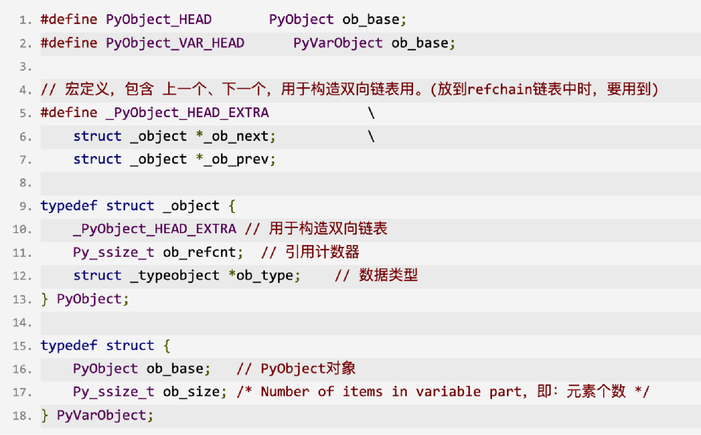

# Python垃圾回收

基于 **C语言源码 ** 底层，让你真正了解垃圾回收机制的实现。

- 引用计数器
- 标记清楚
- 分代回收
- 缓存机制
- Python的C源码（3.8.2版本）

## 1. 引用计数器

### 1.1 环状双向链表 refchain

在python程序中创建的任何对象都会放在refchain链表中。

```python
name = "武沛齐"
age = 18
hobby = ["篮球",'美女']
```

```
内部会创建一些数据【 上一个对象、下一个对象、类型、引用个数 】
name = "武沛齐"
new = name

内部会创建一些数据【 上一个对象、下一个对象、类型、引用个数、val=18】
age = 18

内部会创建一些数据【 上一个对象、下一个对象、类型、引用个数、items=元素、元素个数 】
hobby = ["篮球",'美女']
```

在C源码中如何体现每个对象中都有的相同的值：PyObject结构体（4个值）。

有多个元素组成的对象：PyObject结构体（4个值） + ob_size 。

### 1.2 类型封装结构体


```python
data = 3.14 

内部会创建：
    _ob_next = refchain中的上一个对象
    _ob_prev = refchain中的下一个对象
    ob_refcnt = 1
    ob_type = float
    ob_fval = 3.14
```

### 1.3 引用计数器

```python
v1 = 3.14
v2 = 999
v3 = (1,2,3)
```

当python程序运行时，会根据数据类型的不同找到其对应的结构体，根据结构体中的字段来进行创建相关的数据，然后将对象添加到refchain双线链表中。

在C源码中有两个关键的结构体：PyObject、PyVarObject。



每个对象中有 ob_refcnt就是引用计数器，值默认为 1 ，当有其他变量引用对象时，引用计数器就会发生变化。

- 引用

  ```python
  a = 99999
  b = a
  ```
- 删除引用

  ```python
  a = 99999
  b = a
  del b # b变量删除；b对应对象引用计数器-1
  del a # a变量删除；a对应对象引用计数器-1

  # 当一个对象的引用计数器为0时，意味着没有人再使用这个对象了，这个对象就是垃圾，垃圾回收。
  # 回收：1.对象从refchain链表移除；2.将对象销毁，内存归还。
  ```

### 1.4 循环引用问题


## 2.标记清除

目的：为了解决引用计数器循环引用的不足。

实现：在python的底层 再 维护一个链表，链表中专门放那些可能存在循环引用的对象（list/tuple/dict/set）。


在Python内部 `某种情况`下触发，回去扫描 `可能存在循环应用的链表`中的每个元素，检查是否有循环引用，如果有则让双方的引用计数器 -1 ；如果是0则垃圾回收。

问题：

- 什么时候扫描？
- 可能存在循环引用的链表扫描代价大，每次扫描耗时久。

## 3.分代回收


将可能存在循环应用的对象维护成3个链表：

- 0代：0代中对象个数达到700个扫描一次。
- 1代：0代扫描10次，则1代扫描一次。
- 2代：1代扫描10次，则2代扫描一次。

## 4.小结

在python中维护了一个refchain的双向环状链表，这个链表中存储程序创建的所有对象，每种类型的对象中都有一个ob_refcnt引用计数器的值，引用个数 + 1、-1 ，最后当引用计数器变为0时会进行垃圾回收（对象销毁、refchain中移除）。

但是，在python中对于那些可以有多个元素组成的对象可能会存在循环引用的问题，为了解决这个问题python又引入了标记清除和分代回收，在其内部为了4个链表，

- refchain
- 2代，10寸
- 1代，10次
- 0代，700个

在源码内部当达到各自的阈值时，就会触发扫描链表进行标记清除的动作（有循环则各自-1）。

But，源码内部在上述的流程中提出了优化机制。

## 5. Python缓存

### 5.1 池（int）

为了避免重复创建和销毁一些常见对象，维护池。

```python
# 启动解释器时，Python内部帮我们创建：-5、-4、..... 257
v1 = 7  # 内部不会开辟内存，直接去池中获取
v2 = 9  # 内部不会开辟内存，直接去池中获取
v3 = 9  # 内部不会开辟内存，直接去池中获取

print(id(v2),id(v3))

v4 = 999
v5 = 666
v6 = 666
```

### 5.2 free_list（float/list/tuple/dict)

当一个对象的引用计数器为0时，按理说应该回收，内部不会直接回收，而是将对象添加到 free_list 链表中当缓存。以后再去创建对象时，不再重新开辟内存，而是直接使用free_list。

```python
v1 = 3.14  # 开辟内存，内部存储结构体中定义那几个值，并存到refchain中。

del v1     # refchain中移除，将对象添加到 free_list 中（80个），free_list满了则销毁。


v9 = 999.99 # 不会重新开辟内存，去free_list中获取对象，对象内部数据初始化，再放到refchain中。
```

详见：https://pythonav.com/wiki/detail/6/88/

## 6.源码分析

### 6.1 float类型

### 6.2 list类型

更多详细请参考：https://pythonav.com/wiki/detail/6/88/
